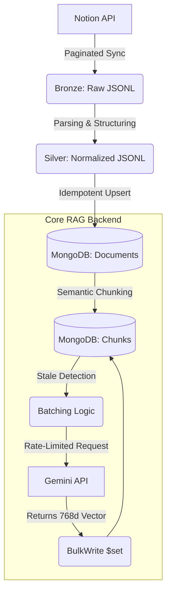

# 🚀 AITwin | End-to-End LLM Learning Assistant

**A production-grade Retrieval-Augmented Generation (RAG) system built in Python.**

This portfolio project demonstrates a complete, fault-tolerant Data Engineering and AI pipeline. It ingests unstructured data from Notion, processes it through multiple quality layers (Bronze/Silver), breaks it into semantic chunks, and generates vector embeddings via the Gemini AI API for semantic search.

---

## 🏗️ Architecture & Data Flow



---

## 🌟 Key Engineering Highlights (Why I Built It This Way)

As a candidate applying for Software / AI Engineering roles, this project was designed to showcase **enterprise-level best practices** rather than just a simple script:

1. **State Management & "Data Drift" Detection (Hash-based):** 
   Instead of blindly re-embedding all documents, the pipeline generates an `MD5 hash` of the chunk text. It compares this fingerprint to know exactly which chunks have been updated, saving massive API costs and processing time.
2. **Idempotency & Resiliency:**
   Every stage of the pipeline (Warehouse loading, Chunking, Embedding) is designed to be **Idempotent**. You can run the pipeline 100 times, and it will gracefully skip existing data using MongoDB's `$set` and unique indexes, preventing duplicate records.
3. **Advanced Object-Oriented Patterns:**
   - **Strategy Pattern (`EmbeddingProvider`)**: The architecture decouples the main pipeline from the specific AI provider, making it trivial to swap Gemini for OpenAI or Local models.
   - **Singleton Pattern (`EmbeddingModelSingleton`)**: Guarantees the API client is instantiated only once into memory, preventing memory leaks during massive 10,000+ chunk ingestion runs.
4. **API Rate Limiting & Batching:**
   The embedding orchestrator respects Google's quotas by compiling data into batches (80 items/batch). It includes custom **Exponential Backoff (`time.sleep(2**attempt)`)** inside a retry loop to gracefully survive "Too Many Requests" 429 Errors.
5. **Production Observability:**
   Includes a `--dry-run` flag to validate pipeline behavior before committing database writes, alongside rich `logging` configured for exact performance durations and success/fail/skip counts.

---

## 🚀 Quick Start (Local Setup)

Want to run the pipeline yourself?

**1. Environment Setup**
```powershell
python -m venv .venv
.\.venv\Scripts\Activate.ps1
pip install -U pip
pip install -r requirements.txt
```

**2. Credentials**
Create a `.env` file containing your Notion and Google AI Studio API credentials (see `.env.example`).

**3. Run the Data Ingestion (Notion -> Local JSONL)**
```powershell
python scripts/ingest_notes.py
```

**4. Run the Data Warehouse Loader (JSONL -> MongoDB)**
```powershell
python -m src.warehouse.mongodb.load_silver_to_mongodb
```

**5. Run the RAG Chunking Pipeline (Phase 1)**
```powershell
python src/rag/build_chunks.py
```

**6. Run the RAG Embedding Pipeline (Phase 2)**
```powershell
python src/rag/build_embeddings.py
```

---

## 📂 Project Structure

```text
mini-llm-twin/
  app/                        # Next Phase: API & UI Layer
  scripts/                    # Entry points for Notion Ingestion
  src/
    config.py                 # Centralized Env/Config manager
    utils/                    # Shared MongoDB and IO Utilities
    warehouse/                # Bronze -> Silver -> Mongo ETL loaders
    rag/                      # Core AI: Chunking & Embeddings Engine
  data/                       # Local JSONL storage for Bronze/Silver
  docs/                       # Architecture diagrams & workflows
```

---

## 🛣️ Roadmap & Milestones

- [x] **Phase 0:** Data Engineering Baseline (`Notion -> Bronze/Silver/State`)
- [x] **Phase 1:** MongoDB Warehouse & Semantic Chunking 
- [x] **Phase 2:** AI Embedding Orchestration
- [ ] **Phase 3:** RAG Retrieval Layer (Vector Search & Ranking)
- [ ] **Phase 4:** API serving endpoints (`/search` & `/ask`)
- [ ] **Phase 5:** Cloud Deployment & Recruiter Demo Polish

---

> *"Built with a focus on code maintainability, fault-tolerance, and scalable AI data infrastructure."*
