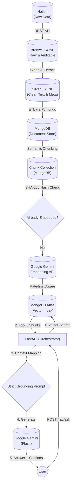

# AITwin | End-to-End LLM Learning Assistant

**A production-grade Retrieval-Augmented Generation (RAG) system built in Python.**

This portfolio project demonstrates a complete, fault-tolerant Data Engineering and AI pipeline. It ingests unstructured data from Notion, processes it through multiple quality layers (Bronze/Silver), breaks it into semantic chunks, and generates vector embeddings via the Gemini AI API for semantic search.

---

## System Architecture



---

## Architectural Tradeoffs
*   **App-side Cosine vs MongoDB Atlas Vector Search**: I opted to use Atlas `$vectorSearch` instead of downloading chunks to memory to compute cosine similarity locally. While local computing is fine for prototypes, Atlas utilizes an Approximate Nearest Neighbor (ANN) index (HNSW), guaranteeing sub-linear search time as the dataset grows.
*   **Defensive LLM Invocation**: The generation component utilizes a specific `try/except` wrapper to handle missing candidates due to the AI's internal safety block, preventing 500 errors.

---

## Key Engineering Highlights (Why I Built It This Way)

As a candidate applying for Software / AI Applied / Data Engineering roles, this project was designed to showcase **enterprise-level best practices** rather than just a simple script:

1. **State Management & "Data Drift" Detection (Hash-based):** 
   Instead of blindly re-embedding all documents, the pipeline generates a `SHA-256 hash` of the chunk text. It compares this fingerprint to know exactly which chunks have been updated, saving massive API costs and processing time.
2. **Idempotency & Resiliency:**
   Every stage of the pipeline (Warehouse loading, Chunking, Embedding) is designed to be **Idempotent**. You can run the pipeline 100 times, and it will gracefully skip existing data using MongoDB's `$set` and unique indexes, preventing duplicate records.
3. **Advanced Object-Oriented Patterns:**
   - **Strategy Pattern (`EmbeddingProvider`)**: The architecture decouples the main pipeline from the specific AI provider, making it trivial to swap Gemini for OpenAI or Local models.
   - **Singleton Pattern (`EmbeddingModelSingleton`)**: Guarantees the API client is instantiated only once into memory, preventing memory leaks during massive 10,000+ chunk ingestion runs.
4. **API Rate Limiting & Batching:**
   The embedding orchestrator respects Google's quotas by compiling data into batches (80 items/batch). It includes custom **Exponential Backoff (`time.sleep(2**attempt)`)** inside a retry loop to gracefully survive "Too Many Requests" 429 Errors.
5. **Production Observability & Resilience:**
   Includes a `--dry-run` flag for ingestion, and the Retrieval API handles external failures gracefully. If an AI provider or Database is unreachable, the system returns a safe empty state instead of crashing, ensuring high availability.
6. **API Contract Enforcement (Pydantic):**
   The retrieval layer uses strict Pydantic models to validate incoming data. This "Fail Fast" approach prevents database injection and expensive AI API calls for invalid input.

---

## Quick Start (Local Setup)

Want to run the pipeline yourself?

**1. Environment Setup (Mac/Linux)**
```bash
python3 -m venv .venv
source .venv/bin/activate
pip install -U pip
pip install -r requirements.txt
```

**2. Credentials**
Create a `.env` file containing Notion, Google AI Studio, and MongoDB API credentials (see `.env.example`).

**3. Ingest Data (Data Engineering Phase)**
```bash
python scripts/ingest_notes.py
python -m src.warehouse.mongodb.load_silver_to_mongodb
```

**4. Run complete RAG Pipeline (Chunking & Embedding)**
```bash
python src/rag/build_chunks.py
python src/rag/build_embeddings.py
```

**5. Start the Live AI Twin Generation API**
```bash
uvicorn app.main:app --reload
```
Then visit `http://127.0.0.1:8000/docs` to test endpoints manually via the Swagger UI.

---

## Troubleshooting Guide
*   **`500 Internal Server Error` on API call**: Ensure your strings inside `.env` are wrapped in quotes. Ensure your server was started using `--reload` to pick up changes. 
*   **`422 Unprocessable Entity`**: Your JSON payload does not strictly match the Pydantic schema (e.g. `top_k < 1`).
*   **`429 Too Many Requests`**: Google Gemini API Free-tier limit hit. The script handles this gracefully via exponential backoff; simply wait a minute.
*   **Empty Retrieval / Blank strings**: Ensure you successfully ran `build_chunks` and `build_embeddings` and that your vector search index exists in MongoDB Atlas correctly matching `numCandidates`.


---

## Project Structure

```text
mini-llm-twin/
  app/                        # Next Phase: API & UI Layer
  scripts/                    # Entry points for Notion Ingestion
  src/
    config.py                 # Centralized Env/Config manager
    utils/                    # Shared MongoDB and IO Utilities
    warehouse/                # Bronze -> Silver -> Mongo ETL loaders
    rag/                      # Core AI: Chunking & Embeddings Engine
  data/                       # Local JSONL storage for Bronze/Silver
  docs/                       # Architecture diagrams & workflows
```

---

## Roadmap & Milestones

- [x] **Phase 0:** Data Engineering Baseline (`Notion -> Bronze/Silver/State`)
- [x] **Phase 1:** MongoDB Warehouse & Semantic Chunking 
- [x] **Phase 2:** AI Embedding Orchestration
- [x] **Phase 3:** RAG Retrieval Layer (Vector Search & FastAPI)
- [x] **Phase 4:** LLM Generation API (`/ask`) with Citations
- [x] **Phase 5:** System QA, Evaluative Benchmarking, and Documentation
- [ ] **Phase 6:** Cloud Deployment & Portfolio Connection

---

> *"Built with a focus on code maintainability, fault-tolerance, and scalable AI data infrastructure."*
