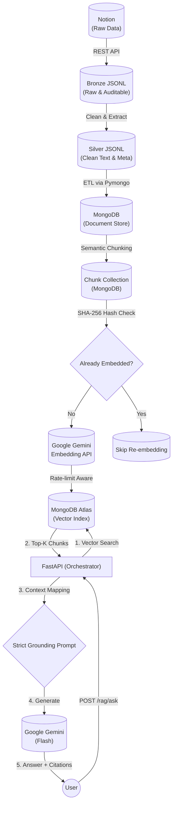

# AITwin | End-to-End LLM Learning Assistant

**A production-grade Retrieval-Augmented Generation (RAG) system built in Python.**

This portfolio project demonstrates a complete, fault-tolerant Data Engineering and AI pipeline. It ingests unstructured data from Notion, processes it through multiple quality layers (Bronze/Silver), breaks it into semantic chunks, and generates vector embeddings via the Gemini AI API for semantic search.

---

## System Architecture



---

## Architectural Tradeoffs
*   **App-side Cosine vs MongoDB Atlas Vector Search**: I opted to use Atlas `$vectorSearch` instead of downloading chunks to memory to compute cosine similarity locally. While local computing is fine for prototypes, Atlas utilizes an Approximate Nearest Neighbor (ANN) index (HNSW), guaranteeing sub-linear search time as the dataset grows.
*   **Defensive LLM Invocation**: The generation component utilizes a specific `try/except` wrapper to handle missing candidates due to the AI's internal safety block, preventing 500 errors.

---

## Key Engineering Highlights (Why I Built It This Way)

As a candidate applying for Software / AI Applied / Data Engineering roles, this project was designed to showcase **enterprise-level best practices** rather than just a simple script:

1. **State Management & "Data Drift" Detection (Hash-based):** 
   Instead of blindly re-embedding all documents, the pipeline generates a `SHA-256 hash` of the chunk text. It compares this fingerprint to know exactly which chunks have been updated, saving massive API costs and processing time.
2. **Idempotency & Resiliency:**
   Every stage of the pipeline (Warehouse loading, Chunking, Embedding) is designed to be **Idempotent**. You can run the pipeline 100 times, and it will gracefully skip existing data using MongoDB's `$set` and unique indexes, preventing duplicate records.
3. **Advanced Object-Oriented Patterns:**
   - **Strategy Pattern (`EmbeddingProvider`)**: The architecture decouples the main pipeline from the specific AI provider, making it trivial to swap Gemini for OpenAI or Local models.
   - **Singleton Pattern (`EmbeddingModelSingleton`)**: Guarantees the API client is instantiated only once into memory, preventing memory leaks during massive 10,000+ chunk ingestion runs.
4. **API Rate Limiting & Batching:**
   The embedding orchestrator respects Google's quotas by compiling data into batches (80 items/batch). It includes custom **Exponential Backoff (`time.sleep(2**attempt)`)** inside a retry loop to gracefully survive "Too Many Requests" 429 Errors.
5. **Production Observability & Resilience:**
   Includes a `--dry-run` flag for ingestion, and the Retrieval API handles external failures gracefully. If an AI provider or Database is unreachable, the system returns a safe empty state instead of crashing, ensuring high availability.
6. **API Contract Enforcement (Pydantic):**
   The retrieval layer uses strict Pydantic models to validate incoming data. This "Fail Fast" approach prevents database injection and expensive AI API calls for invalid input.

---

## Quick Start & RAG Runbook

Follow these steps to run the end-to-end pipeline:

**1. Environment Setup**
```bash
python3 -m venv .venv
source .venv/bin/activate
pip install -r requirements.txt
```

**2. Data Engineering (Ingestion & Warehouse)**
```bash
# Crawl Notion and generate Bronze/Silver JSONL
python scripts/ingest_notes.py

# Load Silver data into the MongoDB Warehouse
python -m src.warehouse.mongodb.load_silver_to_mongodb
```

**3. RAG Pipeline (Chunking & Embedding)**
```bash
# Break Silver docs into semantic chunks (SHA-256 enabled)
python src/rag/build_chunks.py

# Generate vectors and sync to Atlas HNSW Index
python src/rag/build_embeddings.py
```

**4. Inference (API)**
```bash
# Start the FastAPI server
uvicorn app.main:app --reload
```

**5. Verification**
- **Semantic Search**: `POST /rag/search` with `{"query": "..."}` to view raw retrieved chunks and similarity scores.
- **AI Twin Ask**: `POST /rag/ask` with `{"query": "..."}` to see the final grounded answer with citations.

---

## Technical & Architectural Tradeoffs

*   **App-side Cosine vs MongoDB Atlas Vector Search**: I opted for Atlas `$vectorSearch` over local computing. Local retrieval (loading all vectors into memory) works for small sets but fails as data scales. Atlas uses **HNSW (Hierarchical Navigable Small Worlds)**, an Approximate Nearest Neighbor (ANN) algorithm that provides sub-linear search time.
*   **Vector Indexing**: Chose `numDimensions: 768` (matching Gemini models) and `similarity: "cosine"`. While Euclidean distance is an option, Cosine Similarity is the industry standard for text embeddings as it focuses on the "orientation" (meaning) regardless of document length.
*   **Idempotency vs Speed**: I prioritized consistency over raw insertion speed. By hashing `SHA-256` content, we ensure that running the pipeline 100 times results in **zero** duplicate embeddings.

---

## Demo Script (3-Minute Tour)

Use this script to showcase the "Twin" in a professional setting:

1.  **The Pipeline**: Show the `README.md` architecture diagram to explain the **Bronze/Silver/Gold** data layers.
2.  **The API**: Open `http://127.0.0.1:8000/docs`. Execute a inquiry about "Kelvin's skills". Show how the AI returns **Citations** with source tracking—proving it is not hallucinating.
3.  **The Persona**: Ask "How are you?". The AI should respond as a friendly "AI Twin" (Mode 1).
4.  **The Engineering**: Open `src/rag/generation.py` to show the **Retry Logic** and **Prompt Engineering**—explaining how the system survives network failures and switches personas.

---

## Troubleshooting Guide
*   **Quota Issues**: If you see `429 Too Many Requests`, the pipeline will automatically wait and retry. Simply let the script run.
*   **Empty Search Results**: Ensure you ran `build_embeddings.py` AND that the `vector_index` is created in your MongoDB Atlas UI (Search -> Create Vector Index).
*   **Missing API Key**: Ensure `.env` is in the root directory and keys are NOT wrapped in quotes (e.g., `API_KEY=xxx`).
*   **Internal Failures**: The generation layer handles TCP drops (`Errno 60`). If the LLM still fails after 3 retries, check your internet connectivity.


---

## Project Structure

```text
mini-llm-twin/
  app/                        # Next Phase: API & UI Layer
  scripts/                    # Entry points for Notion Ingestion
  src/
    config.py                 # Centralized Env/Config manager
    utils/                    # Shared MongoDB and IO Utilities
    warehouse/                # Bronze -> Silver -> Mongo ETL loaders
    rag/                      # Core AI: Chunking & Embeddings Engine
  data/                       # Local JSONL storage for Bronze/Silver
  docs/                       # Architecture diagrams & workflows
```

---

## Roadmap & Milestones

- [x] **Phase 0:** Data Engineering Baseline (`Notion -> Bronze/Silver/State`)
- [x] **Phase 1:** MongoDB Warehouse & Semantic Chunking 
- [x] **Phase 2:** AI Embedding Orchestration
- [x] **Phase 3:** RAG Retrieval Layer (Vector Search & FastAPI)
- [x] **Phase 4:** LLM Generation API (`/ask`) with Citations
- [x] **Phase 5:** System QA, Evaluative Benchmarking, and Documentation
- [x] **Phase 6:** Cloud Deployment & Portfolio Connection

---

> *"Built with a focus on code maintainability, fault-tolerance, and scalable AI data infrastructure."*
